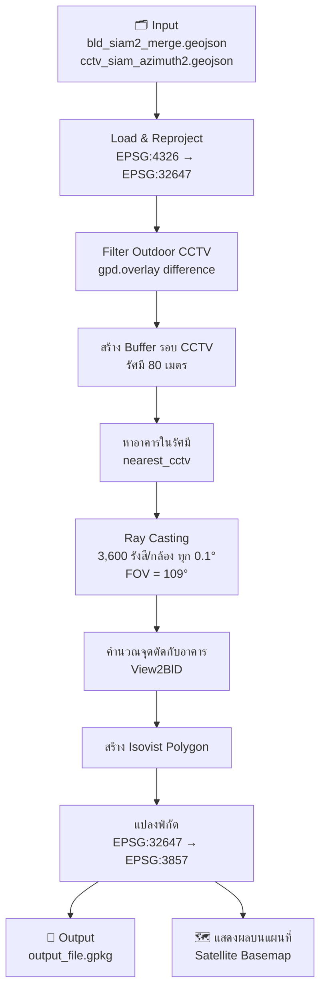
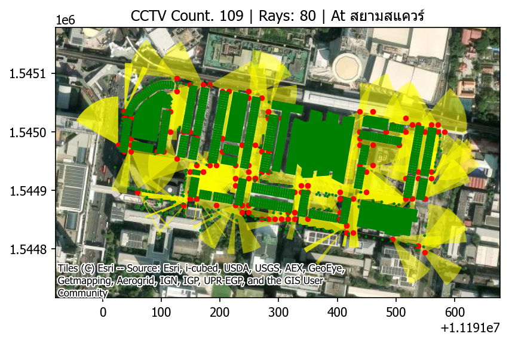

# CCTV Isovist Analysis — สยามสแควร์

วิเคราะห์พื้นที่การมองเห็นของกล้อง CCTV (Isovist) บริเวณสยามสแควร์ โดยใช้เทคนิค Ray Casting ร่วมกับข้อมูล GIS

---

## Workflow



---

## ขั้นตอนการวิเคราะห์

| ขั้นตอน | รายละเอียด |
|---|---|
| 1. โหลดข้อมูล | อ่านไฟล์ GeoJSON อาคารและ CCTV แล้ว reproject เป็น UTM Zone 47N (EPSG:32647) |
| 2. กรอง CCTV | แยก CCTV ที่อยู่ภายนอกอาคารด้วย spatial overlay |
| 3. Buffer | สร้าง circular buffer รัศมี 80 เมตรรอบแต่ละ CCTV |
| 4. หาอาคารใกล้เคียง | รวมอาคารที่ตัดกับ buffer เป็น union geometry |
| 5. Ray Casting | ยิง ray ทุก 0.1° ภายใน FOV 109° ของกล้อง |
| 6. ตรวจสอบสิ่งกีดขวาง | แต่ละ ray หาจุดตัดกับอาคารที่ใกล้สุด |
| 7. สร้าง Polygon | เชื่อมปลาย ray ทุกเส้นเป็น isovist polygon |
| 8. Export | บันทึกผลเป็น GeoPackage และแสดงบน satellite basemap |

---

## โครงสร้างโปรเจกต์

```
spatial-cctv-isovists/
├── run_1.py                    # สคริปต์หลัก
├── test_isovist.py             # Unit tests (26 tests)
├── conftest.py                 # Pytest configuration
├── pytest.ini                  # Pytest warning filters
├── data/
│   ├── bld_siam2_merge.geojson # ข้อมูลอาคาร
│   ├── cctv_siam_azimuth2.geojson # ตำแหน่งและมุมกล้อง CCTV
│   └── ...
└── images/                     # รูปผลลัพธ์
```

---

## การติดตั้ง

```bash
pip install geopandas shapely numpy pandas matplotlib contextily pytest
```

---

## การใช้งาน

```bash
# รันการวิเคราะห์
python run_1.py

# รัน unit tests
python -m pytest test_isovist.py -v
```

---

## พารามิเตอร์หลัก

| พารามิเตอร์ | ค่า | ความหมาย |
|---|---|---|
| `rays` | 80 เมตร | รัศมีการมองเห็นสูงสุด |
| `FOV_DEGREES` | 109° | มุมมองของกล้อง |
| `ANGLE_STEP` | 0.1° | ความละเอียดของ ray casting |
| CRS (คำนวณ) | EPSG:32647 | UTM Zone 47N |
| CRS (output) | EPSG:3857 | Web Mercator |
```

---
## ผลลัพธ์

### แผนที่ Isovist ของ CCTV ทั้งหมด

